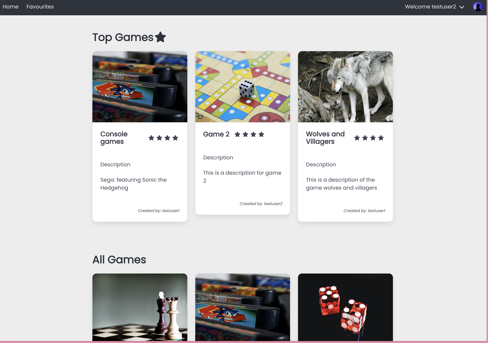
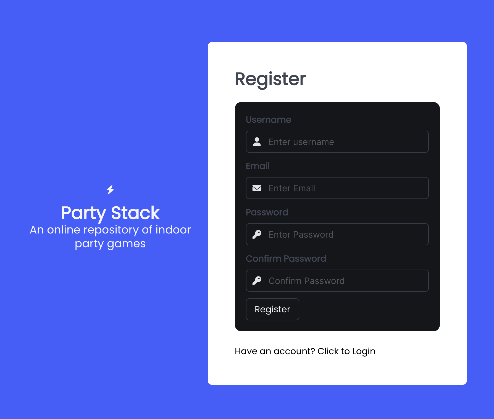
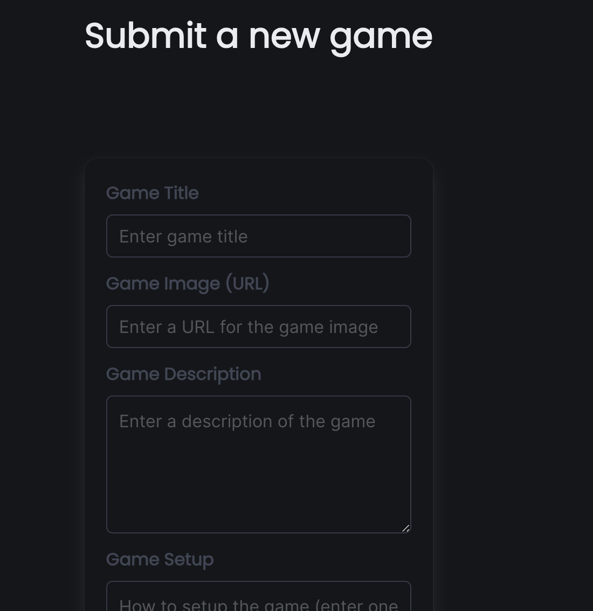
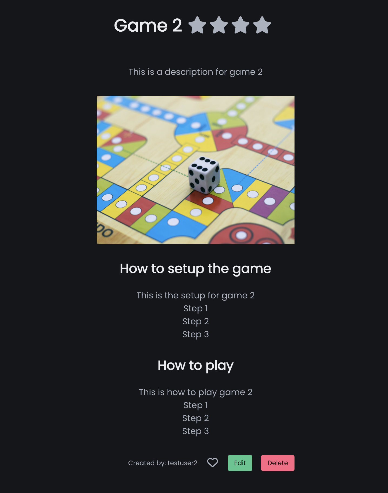
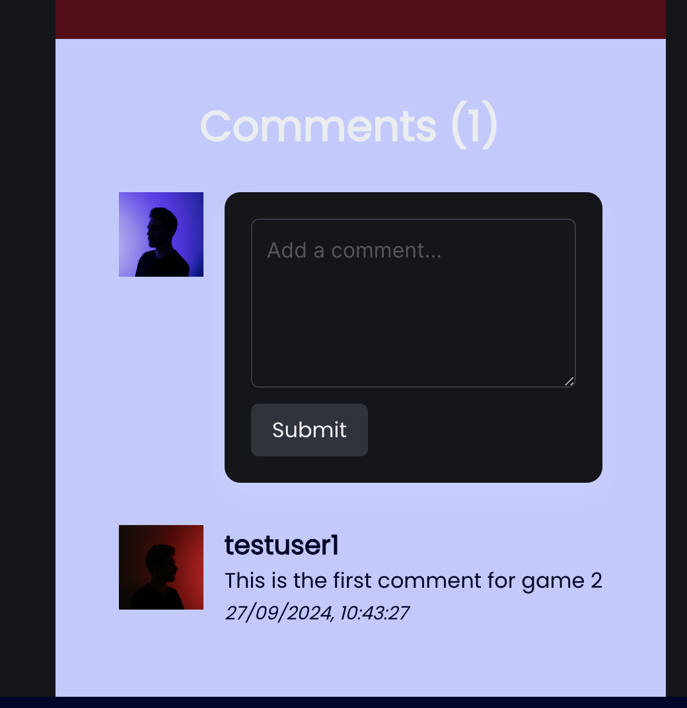
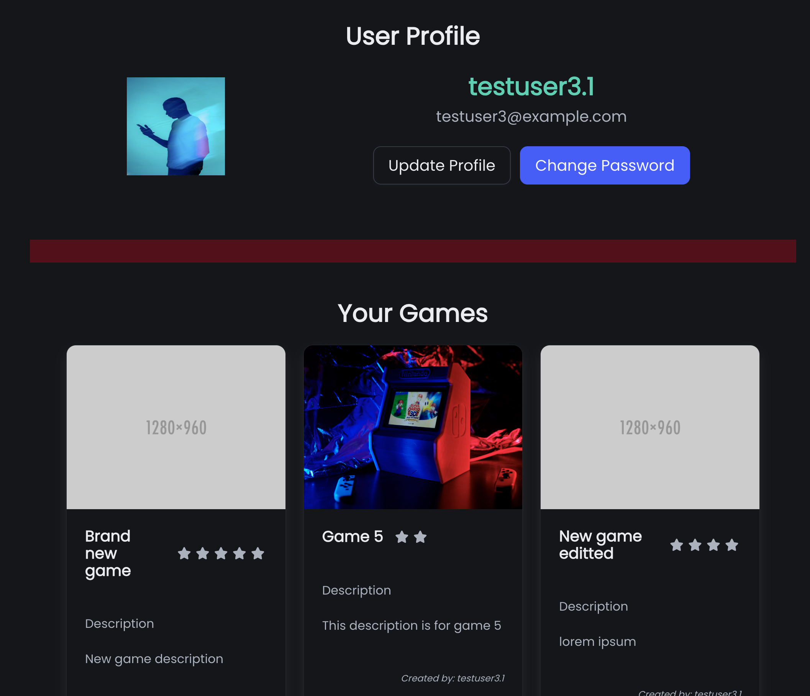

# Project 3 - Party Stack FE

##### An online repository of indoor party games

## Overview

This project was developed independently over the course of one week, utilizing a ReactJS frontend and a Node.js/Express backend.



Visit the project [live](https://party-stack.netlify.app/)

## The Brief

- Develop a React frontend application that asynchronously interacts with a backend service to perform CRUD operations on a NoSQL database.

## Technologies used

- HTML 5
- CSS 3
- Bulma CSS
- ReactJS
- TypeScript
- Git
- GitHub

---

## Getting Started

This [project](https://party-stack.netlify.app/) requires you to create an account to explore its features. You can use the following test user account details to gain access.

```
username: testuser2@example.com
password: #T3stUs3r
```

## Key Features

#### Create account



#### Create game



#### Game details page



#### Creating comments



#### User profile page


